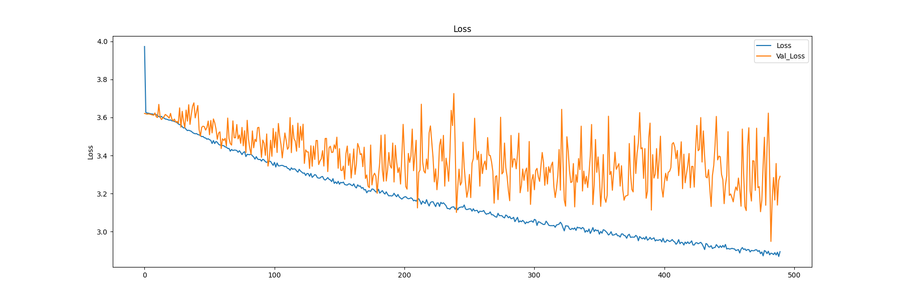
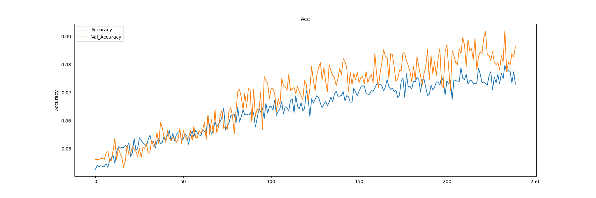
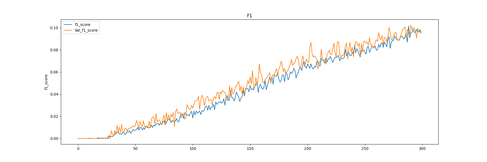
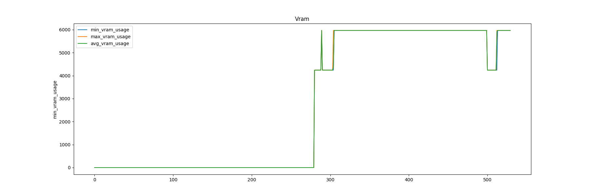
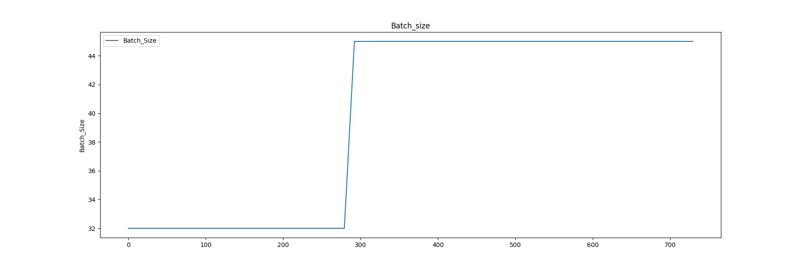

# Proyecto 3 Hackaboss

### Instalación

Para poder trabajar con este repositorio, es necesario tener la versión 3.10.X de Python y tener Git instalado en el sistema operativo. Se deben seguir estos pasos para la correcta instalación:

- Clone este repositorio de forma local en la ubicación deseada. Esto generará una carpeta `project_hackaboss` que contiene todos los archivos y carpetas del proyecto:
```sh
git clone https://github.com/cuicuidev/project_hackaboss
```

- Después de clonar el repo, hay que navegar hacia la carpeta que se ha creado:
```sh
cd project_hackaboss
```

- A continuación, cree el entorno virtual:
```sh
python -m venv .env
```

- **Nota**: Si tiene instalado Anaconda, desactive su entorno:
```sh
conda deactivate
```

- Active el entorno virtual que acaba de instalar:

  **Para Linux/macOS**:
  ```sh
  source ./.env/bin/activate
  ```

  **Para usuarios de Windows en cmd (Símbolo de Sistema)**:
  ```sh
  .\.env\Scripts\activate
  ```

  **Para usuarios de Windows en PowerShell**:
  ```sh
  .\.env\Scripts\Activate.ps1
  ```

- Finalmente, instale todas las dependencias del proyecto en el entorno virtual:
```sh
pip install -r requirements.txt
```

¡Ya está listo para trabajar!

## Métricas actuales del modelo:
### Loss Plot

### Acc Plot

### F1 Plot

### Vram Plot

### Batch_size Plot

